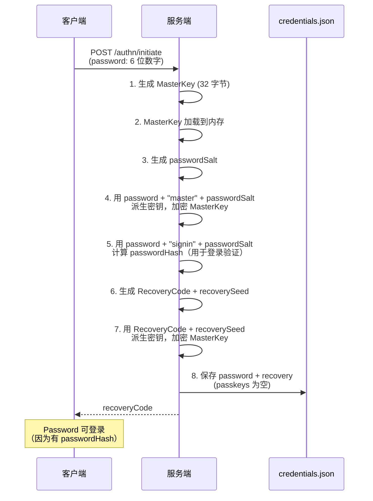
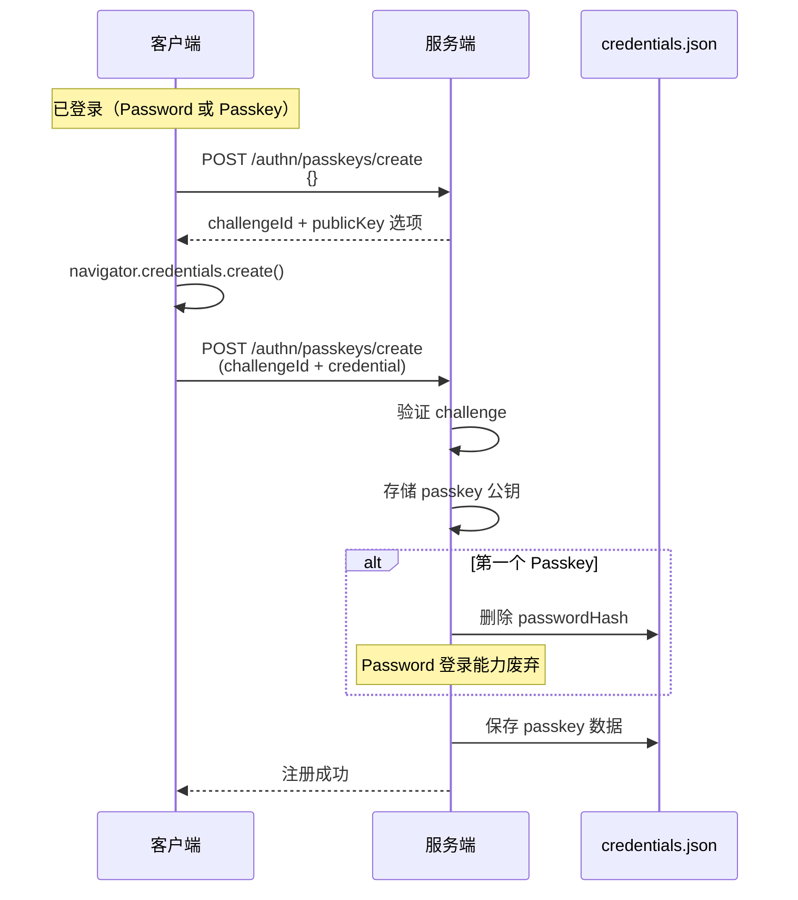
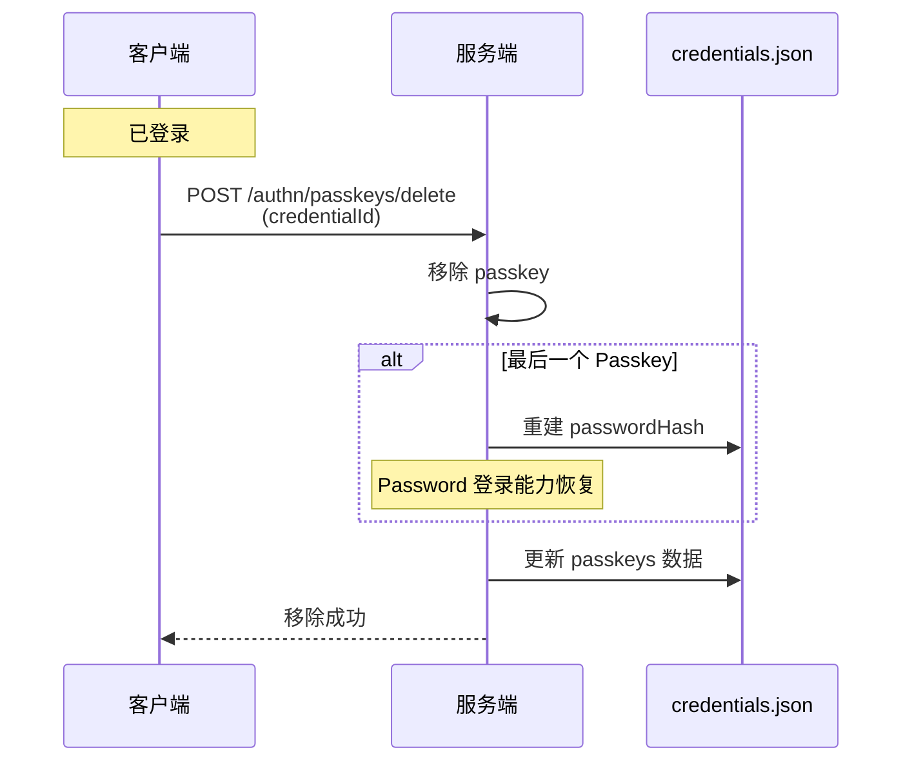
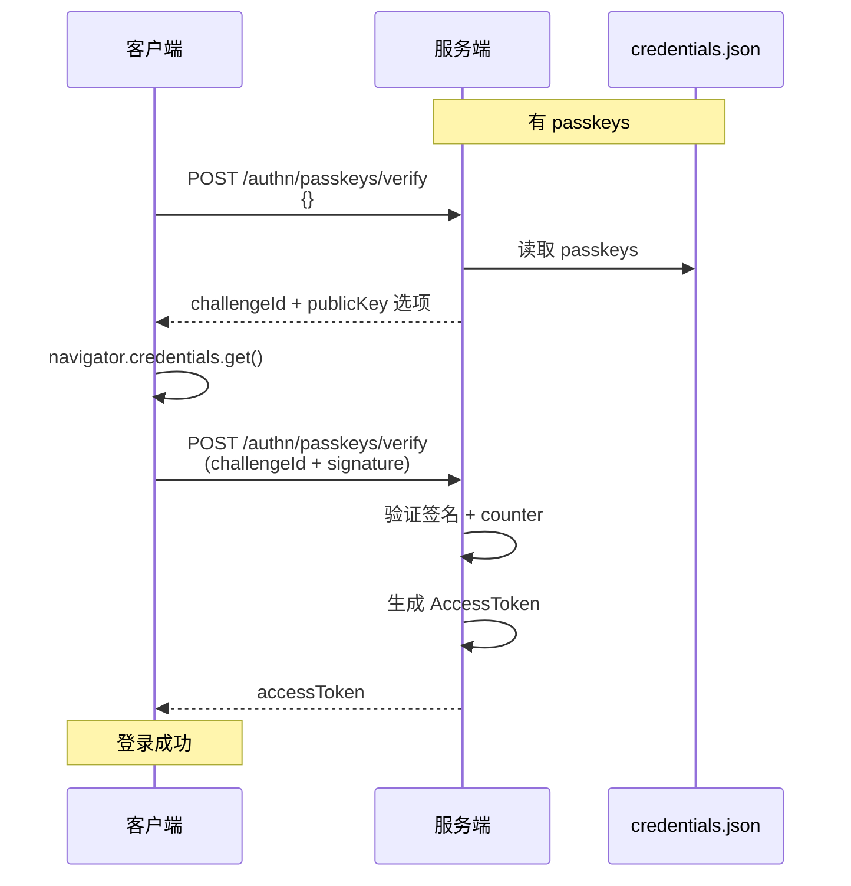
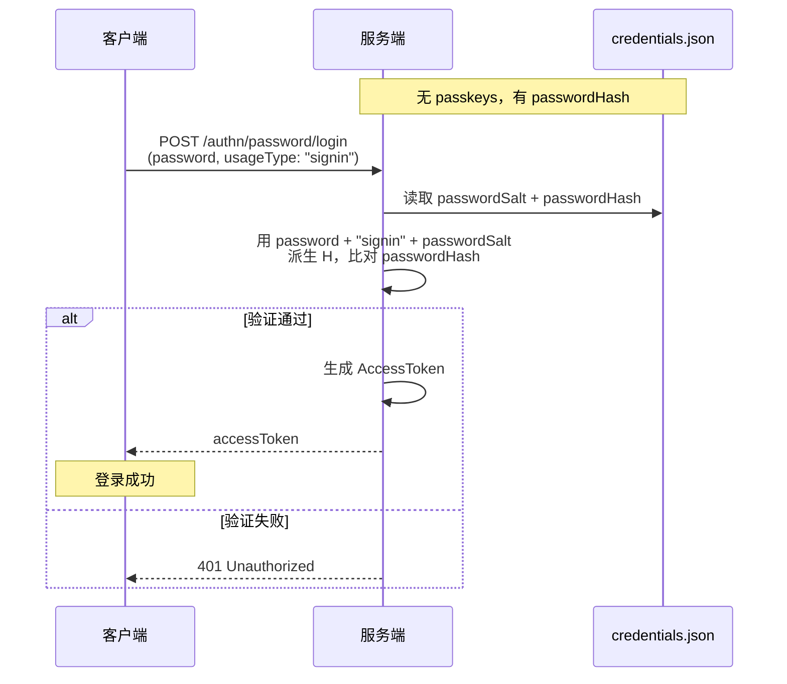
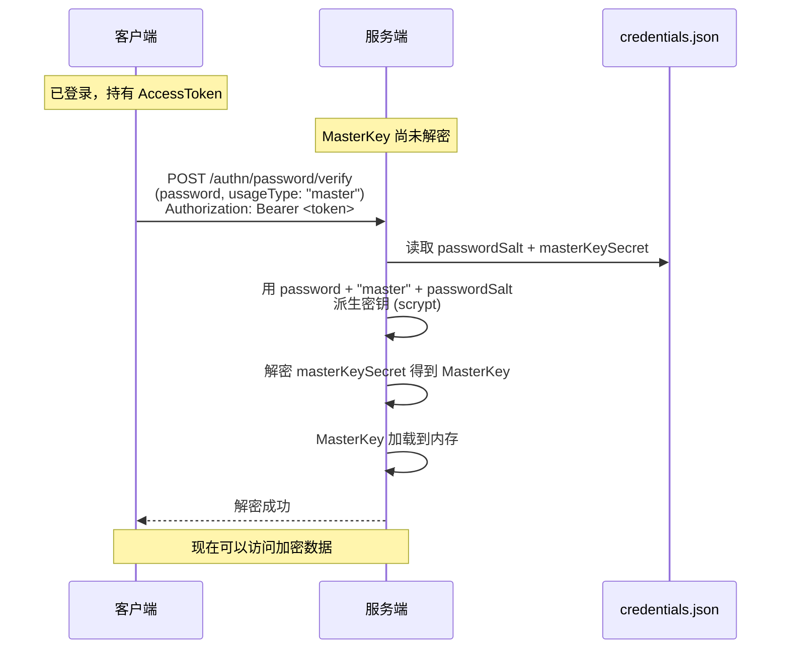
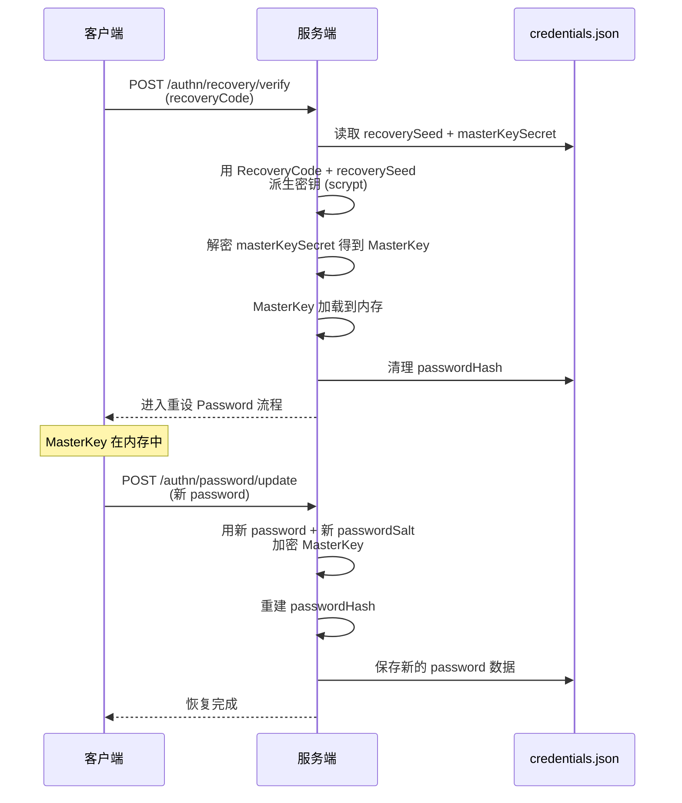
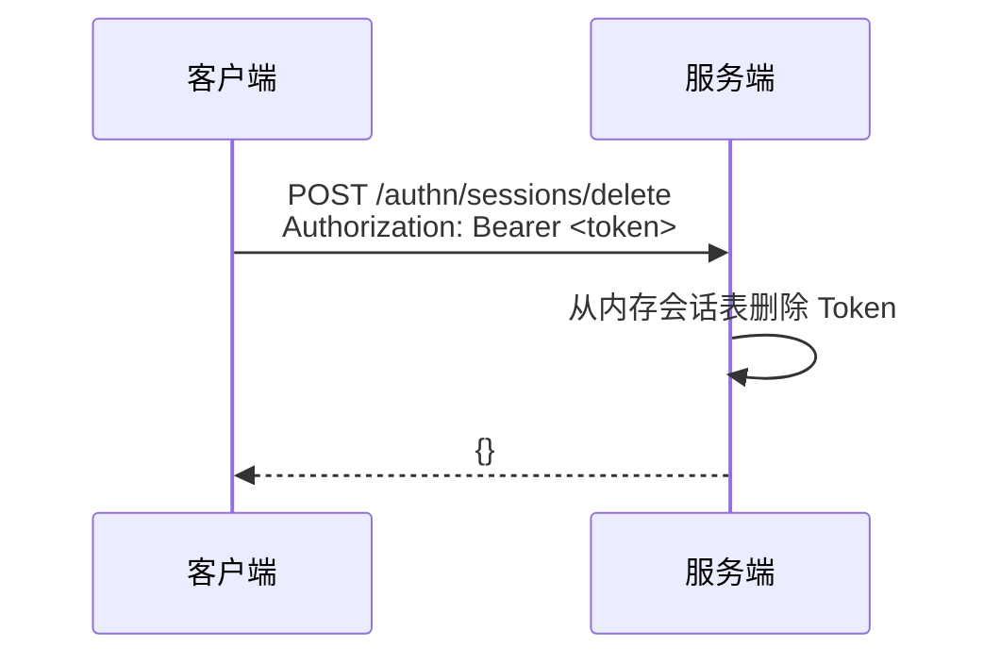

# 认证 API 详细规范

**版本**: 7.0
**状态**: 设计完成
**关联文档**: [API 设计规范](../spec-api.md), [用户认证与安全](../features/auth-security.md)

---

## 概述

本文档定义 Keyroll 系统的认证 API 详细规范。

**设计原则**：
- **Passkey**：优先登录方式，支持多个 Passkey
- **Password**：备用登录 + MasterKey 解密
- **Passkey 流程独立**：不耦合初始化，可随时添加/移除
- **Password 登录能力动态切换**：
  - 有 passwordHash = 可登录
  - 无 passwordHash = 仅解密，不可登录
- **自动切换**：
  - 创建第一个 Passkey → 删除 passwordHash
  - 移除最后一个 Passkey → 重建 passwordHash

---

## 流程概览

### 初始化流程时序图



### Passkey 注册流程时序图



### Passkey 移除流程时序图



### Passkey 登录时序图



### Password 登录时序图（无 Passkey 时）



### Password 解密时序图



### RecoveryCode 恢复时序图



**流程说明**：

| 流程 | API 端点 | 说明 |
|------|----------|------|
| 初始化 | `/authn/initiate` | 一次性操作，生成 MasterKey、设置 Password |
| Passkey 创建 | `/authn/passkeys/create` | 无 challengeId 时生成挑战，有 challengeId 时验证并保存 |
| Passkey 删除 | `/authn/passkeys/delete` | 移除已注册的 Passkey |
| Passkey 登录 | `/authn/passkeys/verify` | 无 challengeId 时生成挑战，有 challengeId 时验证并颁发 Token |
| Password 登录 | `/authn/password/verify` (usageType: "signin") | 使用 Password 登录（无 Passkey 时） |
| Password 解密 | `/authn/password/verify` (usageType: "master") | 验证 Password，解密 MasterKey |
| Password 更新 | `/authn/password/update` | RecoveryCode 恢复后重设 Password |
| RecoveryCode 恢复 | `/authn/recovery/verify` | 使用 RecoveryCode 恢复，进入 Password 更新流程 |

---

## 响应格式

### 成功响应

```json
{
  "traceId": "uuid-v4",
  "content": { ... }
}
```

### 错误响应

```json
{
  "traceId": "uuid-v4",
  "errorId": "ErrorCode",
  "content": { ... }
}
```

| 字段 | 类型 | 说明 |
|------|------|------|
| `traceId` | string | 请求唯一标识（UUID v4） |
| `errorId` | string | 业务错误码（大驼峰格式），仅在失败时出现 |
| `content` | object | 业务数据或错误详情 |

### 错误码定义

| 错误码 | HTTP | 说明 |
|--------|------|------|
| `InvalidRequest` | 400 | 请求参数缺失或格式错误 |
| `TokenInvalid` | 401 | AccessToken 无效或不存在 |
| `SignatureInvalid` | 401 | Passkey 签名验证失败 |
| `ChallengeExpired` | 410 | 挑战已过期（超过 5 分钟） |
| `ChallengeNotFound` | 404 | 挑战 ID 不存在 |
| `CounterRegression` | 401 | Counter 回退，可能存在凭证克隆 |
| `RecoveryCodeInvalid` | 401 | RecoveryCode 格式错误或验证失败 |
| `RecoveryAttemptExceeded` | 429 | 恢复尝试次数超限 |
| `PasswordInvalid` | 401 | Password 格式错误或验证失败 |
| `PasswordAttemptExceeded` | 429 | Password 尝试次数超限 |
| `PasswordLoginDisabled` | 403 | Password 登录已禁用（有 Passkey） |
| `AlreadyInitialized` | 409 | 系统已初始化（重复调用 init） |
| `NotInitialized` | 503 | 系统未初始化 |
| `ServerError` | 500 | 服务器内部错误 |
| `ServiceUnavailable` | 503 | 服务不可用 |

---

## 系统初始化

### POST /authn/initiate

初始化系统，生成 MasterKey、RecoveryCode，并设置 Password。

**前置条件**：系统未初始化

**请求**
```json
{
  "password": "123456"
}
```

**请求说明**
- `password`: 6 位数字字符串
- 用于加密 MasterKey 和生成 passwordHash

**响应（成功）**
```json
{
  "traceId": "uuid-v4",
  "content": {
    "recoveryCode": "A1B2-C3D4-E5F6-G7H8-I9J0"
  }
}
```

**响应说明**
- `recoveryCode`: 5 组 4 位大写字符，用于紧急恢复
- 用户需要安全保存（纸印或离线存储）
- 此代码仅展示一次，后续无法再次获取
- 初始化后，Password 具备登录能力（因为有 passwordHash）

**错误响应**
| errorId | HTTP |
|---------|------|
| `InvalidRequest` | 400 |
| `AlreadyInitialized` | 409 |

---

## Passkey 管理

### POST /authn/passkeys/create

创建 Passkey，支持注册流程的两阶段操作。

**前置条件**：
- 系统已初始化
- 已认证（持有 AccessToken 或通过 Password 验证）

**请求逻辑**：
- 无 `challengeId`：生成新的挑战，返回 WebAuthn 创建选项
- 有 `challengeId`：验证挑战并保存 Passkey

---

**阶段一：生成挑战**

**请求**
```json
{}
```

**响应（成功）**
```json
{
  "traceId": "uuid-v4",
  "content": {
    "challengeId": "uuid-v4",
    "publicKey": {
      "challenge": "base64url-encoded-random",
      "rp": { "name": "Keyroll", "id": "localhost" },
      "user": { "id": "base64url-encoded-user-id", "name": "default", "displayName": "Default User" },
      "pubKeyCredParams": [{ "type": "public-key", "alg": -7 }],
      "authenticatorSelection": { "authenticatorAttachment": "platform", "residentKey": "required", "userVerification": "required" },
      "timeout": 300000,
      "attestation": "none"
    }
  }
}
```

---

**阶段二：验证并保存**

**请求**
```json
{
  "challengeId": "uuid-v4",
  "credential": {
    "id": "credential-id",
    "rawId": "base64url-encoded",
    "response": {
      "attestationObject": "base64url-encoded",
      "clientDataJSON": "base64url-encoded"
    },
    "type": "public-key"
  }
}
```

**响应（成功）**
```json
{
  "traceId": "uuid-v4",
  "content": {
    "credentialId": "credential-id"
  }
}
```

**响应说明**
- 服务端验证 challenge
- 存储 Passkey 公钥到 passkeys 数组
- **如果这是第一个 Passkey**：删除 passwordHash，Password 登录能力废弃

**错误响应**
| errorId | HTTP |
|---------|------|
| `NotInitialized` | 503 |
| `ChallengeNotFound` | 404 | 仅阶段二，challengeId 不存在 |
| `ChallengeExpired` | 410 | 仅阶段二，挑战已过期（超过 5 分钟） |
| `InvalidRequest` | 400 | 请求参数错误 |
| `ServerError` | 500 | 服务器内部错误 |

---

### POST /authn/passkeys/delete

删除已注册的 Passkey。

**前置条件**：
- 系统已初始化
- 已认证（持有 AccessToken）

**请求**
```json
{
  "credentialId": "credential-id"
}
```

**响应（成功）**
```json
{
  "traceId": "uuid-v4",
  "content": {
    "message": "Passkey 已删除"
  }
}
```

**响应说明**
- 服务端移除指定的 Passkey
- **如果这是最后一个 Passkey**：重建 passwordHash，Password 登录能力恢复

**错误响应**
| errorId | HTTP |
|---------|------|
| `CredentialNotFound` | 404 |
| `TokenInvalid` | 401 |
| `ServerError` | 500 |

---

## Passkey 认证

### POST /authn/passkeys/verify

Passkey 登录验证，支持两阶段操作。

**前置条件**：
- 系统已初始化
- 至少有一个已注册的 Passkey

**请求逻辑**：
- 无 `challengeId`：生成新的挑战，返回 WebAuthn 获取选项
- 有 `challengeId`：验证签名并颁发 AccessToken

---

**阶段一：生成挑战**

**请求**
```json
{}
```

**响应（成功）**
```json
{
  "traceId": "uuid-v4",
  "content": {
    "challengeId": "uuid-v4",
    "publicKey": {
      "challenge": "base64url-encoded-random",
      "timeout": 300000,
      "rpId": "localhost",
      "allowCredentials": [
        { "type": "public-key", "id": "credential-id-1" },
        { "type": "public-key", "id": "credential-id-2" }
      ],
      "userVerification": "required"
    }
  }
}
```

**响应说明**
- `allowCredentials`: 从 `credentials.json` 读取的已注册 passkeys 列表
- 挑战 5 分钟后过期

---

**阶段二：验证签名并颁发 Token**

**请求**
```json
{
  "challengeId": "uuid-v4",
  "credentialId": "credential-id",
  "signature": "base64url-encoded-signature",
  "authenticatorData": "base64url-encoded-auth-data",
  "clientDataJSON": "base64url-encoded-client-data"
}
```

**响应（成功）**
```json
{
  "traceId": "uuid-v4",
  "content": {
    "accessToken": "uuid-v4",
    "expiresIn": 1800,
    "tokenType": "Bearer"
  }
}
```

**响应说明**
- 服务端验证 Passkey 签名（ES256 算法）
- 验证 counter 值，防止凭证克隆
- 认证成功后颁发 AccessToken

**错误响应**
| errorId | HTTP |
|---------|------|
| `NotInitialized` | 503 |
| `CredentialNotFound` | 404 | 无已注册 passkeys（阶段一） |
| `ChallengeNotFound` | 404 | 挑战 ID 不存在（阶段二） |
| `ChallengeExpired` | 410 | 挑战已过期（超过 5 分钟）（阶段二） |
| `SignatureInvalid` | 401 | 签名验证失败（阶段二） |
| `CounterRegression` | 401 | Counter 回退，可能存在凭证克隆（阶段二） |

---

## Password 认证

### POST /authn/password/verify

Password 验证，支持登录和解密两种用途。

**前置条件**：系统已初始化

**请求逻辑**：
- `usageType: "signin"`：登录认证，验证 passwordHash，颁发 AccessToken
- `usageType: "master"`：解密 MasterKey，验证 password 并解密 masterKeySecret

---

**登录认证**

**前置条件**：
- 无已注册 Passkeys
- passwordHash 存在

**请求**
```json
{
  "password": "123456",
  "usageType": "signin"
}
```

**响应（成功）**
```json
{
  "traceId": "uuid-v4",
  "content": {
    "accessToken": "uuid-v4",
    "expiresIn": 1800,
    "tokenType": "Bearer"
  }
}
```

**响应说明**
- 服务端使用 Password + "signin" + passwordSalt 派生密钥
- 比对派生结果与 passwordHash
- 验证成功颁发 AccessToken

**错误响应**
| errorId | HTTP |
|---------|------|
| `PasswordInvalid` | 401 |
| `PasswordAttemptExceeded` | 429 |
| `PasswordLoginDisabled` | 403 | 有 Passkey，Password 登录已禁用 |
| `NotInitialized` | 503 |

---

**解密 MasterKey**

**前置条件**：
- 已通过认证（持有 AccessToken）

**请求**
```json
{
  "password": "123456",
  "usageType": "master"
}
```

**请求头**
```
Authorization: Bearer <access_token>
```

**响应（成功）**
```json
{
  "traceId": "uuid-v4",
  "content": {
    "message": "MasterKey 解密成功"
  }
}
```

**响应说明**
- 服务端使用 Password + "master" + passwordSalt 派生密钥
- 使用派生密钥解密 password.masterKeySecret 得到 MasterKey
- MasterKey 加载到内存，用于后续数据加密/解密

**错误响应**
| errorId | HTTP |
|---------|------|
| `PasswordInvalid` | 401 |
| `PasswordAttemptExceeded` | 429 |
| `TokenInvalid` | 401 | 未通过认证 |
| `NotInitialized` | 503 |

---

### POST /authn/password/update

更新 Password（RecoveryCode 恢复后）。

**前置条件**：
- RecoveryCode 验证成功
- MasterKey 已在内存中

**请求**
```json
{
  "password": "654321"
}
```

**响应（成功）**
```json
{
  "traceId": "uuid-v4",
  "content": {
    "message": "Password 更新成功"
  }
}
```

**响应说明**
- 服务端复用内存中的 MasterKey
- 使用新 Password + 新 passwordSalt 加密 MasterKey
- 重建 passwordHash（Password 登录能力恢复）

**错误响应**
| errorId | HTTP |
|---------|------|
| `InvalidRequest` | 400 |
| `NotInitialized` | 503 |

---

## RecoveryCode 恢复

### POST /authn/recovery/verify

使用 RecoveryCode 验证身份，恢复 MasterKey 并进入重设 Password 流程。

**前置条件**：系统已初始化

**请求**
```json
{
  "recoveryCode": "A1B2-C3D4-E5F6-G7H8-I9J0"
}
```

**响应（成功）**
```json
{
  "traceId": "uuid-v4",
  "content": {
    "message": "RecoveryCode 验证成功，请更新密码",
    "nextStep": "/authn/password/update"
  }
}
```

**响应说明**
- 服务端使用 RecoveryCode + recoverySeed 通过 scrypt 派生密钥（N=2^14, r=8, p=1）
- 使用派生密钥解密 recovery.masterKeySecret 得到 MasterKey
- MasterKey 加载到内存
- **清理现有 passwordHash**
- 客户端需调用 `/authn/password/update` 更新 Password

**错误响应**
| errorId | HTTP |
|---------|------|
| `RecoveryCodeInvalid` | 401 |
| `RecoveryAttemptExceeded` | 429 |
| `NotInitialized` | 503 |

---

## 会话管理

### 会话管理时序图



### POST /authn/sessions/delete

删除会话（登出）。

**请求**
```http
POST /authn/sessions/delete
Authorization: Bearer <access_token>
```

**响应（成功）**
```json
{
  "traceId": "uuid-v4",
  "content": {}
}
```

**响应说明**
- 服务端从内存会话表中删除 Token
- 客户端页面关闭或跳转后，会话自然过期，无需主动通知服务端

**错误响应**
| errorId | HTTP |
|---------|------|
| `TokenInvalid` | 401 | Token 无效或不存在 |

---

## 安全设计

### Passkey 安全

- 使用 WebAuthn 标准 ES256 (ECDSA P-256) 签名
- 每次认证挑战随机生成，5 分钟过期
- Challenge 一次性使用，防止重放攻击
- Counter 防克隆机制

| 错误码 | 说明 |
|--------|------|
| `SignatureInvalid` | Passkey 签名验证失败 |
| `ChallengeExpired` | 挑战已过期（超过 5 分钟） |
| `ChallengeNotFound` | 挑战 ID 不存在 |
| `CounterRegression` | Counter 回退，可能存在凭证克隆 |

### Password 安全

- Password 为 6 位数字（1000000 种可能）
- 使用 scrypt 密钥派生（N=2^14, r=8, p=1），暴力破解成本高
- passwordHash 用于登录验证，不传输明文密码
- 速率限制：最多 5 次尝试/15 分钟

| 错误码 | 说明 |
|--------|------|
| `PasswordInvalid` | Password 格式错误或验证失败 |
| `PasswordAttemptExceeded` | Password 尝试次数超限（5 次/15 分钟） |
| `PasswordLoginDisabled` | Password 登录已禁用（有 Passkey） |

### RecoveryCode 安全

- RecoveryCode 为 5 组 4 位大写字符（约 6.8 亿种可能）
- 使用 scrypt 密钥派生（N=2^14, r=8, p=1）
- 速率限制：最多 5 次尝试/15 分钟

| 错误码 | 说明 |
|--------|------|
| `RecoveryCodeInvalid` | RecoveryCode 格式错误或验证失败 |
| `RecoveryAttemptExceeded` | RecoveryCode 尝试次数超限（5 次/15 分钟） |

### 速率限制

| API | 限制 |
|-----|------|
| RecoveryCode 恢复尝试 | 最多 5 次/15 分钟 |
| Password 登录尝试 | 最多 5 次/15 分钟 |
| Password 解密尝试 | 最多 5 次/15 分钟 |
| Passkey 认证尝试 | 最多 10 次/5 分钟 |

### Token 安全

- AccessToken 使用 UUID v4，不可预测
- Token 仅存储在服务端内存中
- Token 30 分钟无活动自动过期

---

## 加密算法详解

### 加密与解密流程

#### 初始化时加密流程

**Password 加密 MasterKey**

1. 生成随机 passwordSalt（32 字节）
2. 派生解密密钥 K：`scrypt(password, "master" + passwordSalt, N=2^14, r=8, p=1, keyLength=32)`
3. 生成随机 IV（12 字节）
4. 使用 AES-256-GCM 加密 MasterKey，得到 ciphertext 和 authTag
5. 存储 base64(IV || ciphertext || authTag) 到 password.masterKeySecret

**计算 Password 登录哈希**

1. 派生哈希 H：`scrypt(password, "signin" + passwordSalt, N=2^14, r=8, p=1, keyLength=32)`
2. 存储 base64(H) 到 password.passwordHash

**用途隔离说明**：passwordHash 使用 "signin" 前缀拼接到 salt，masterKeySecret 使用 "master" 前缀拼接到 salt，两者完全独立。即使 passwordHash 泄露也无法用于破解 masterKeySecret。

**RecoveryCode 加密 MasterKey**

1. 生成随机 recoverySeed（32 字节）
2. 生成 RecoveryCode（5 组 4 位大写字符）
3. 派生密钥 K：`scrypt(RecoveryCode, recoverySeed, N=2^14, r=8, p=1, keyLength=32)`
4. 生成随机 IV（12 字节）
5. 使用 AES-256-GCM 加密 MasterKey，得到 ciphertext 和 authTag
6. 存储 base64(IV || ciphertext || authTag) 到 recovery.masterKeySecret

#### 认证时解密流程

**Password 登录验证（无 Passkey 时）**

1. 用户输入 Password（6 位数字）
2. 读取 credentials.json 中的 passwordSalt 和 passwordHash
3. 计算 H = scrypt(password, "signin" + passwordSalt, ...)
4. 比对 H 与 passwordHash，匹配则登录成功

**Password 解密 MasterKey**

1. 用户输入 Password（6 位数字）
2. 读取 credentials.json 中的 passwordSalt 和 masterKeySecret（base64 编码）
3. 解析 base64 得到 IV (12 字节) || ciphertext || authTag (16 字节)
4. 计算 K = scrypt(password, "master" + passwordSalt, ...)
5. 使用 AES-256-GCM 解密得到 MasterKey，authTag 验证失败则 Password 错误

**RecoveryCode 解密 MasterKey**

1. 用户输入 RecoveryCode（5 组 4 位大写字符）
2. 读取 credentials.json 中的 recoverySeed 和 masterKeySecret（base64 编码）
3. 解析 base64 得到 IV (12 字节) || ciphertext || authTag (16 字节)
4. 计算 K = scrypt(RecoveryCode, recoverySeed, ...)
5. 使用 AES-256-GCM 解密得到 MasterKey，authTag 验证失败则 RecoveryCode 错误

### 加密参数

| 参数 | 值 | 说明 |
|------|-----|------|
| scrypt N | 2^14 (16384) | CPU/内存成本参数 |
| scrypt r | 8 | 块大小参数 |
| scrypt p | 1 | 并行化参数 |
| scrypt keyLength | 32 | 派生密钥长度（256 位） |
| AES 密钥长度 | 32 | 256 位 |
| AES IV 长度 | 12 | 96 位（推荐值） |
| authTag 长度 | 16 | 128 位 |

---

## HTTP 状态码

| HTTP 状态码 | 使用场景 |
|-------------|----------|
| 200 | 成功 |
| 201 | 资源创建成功 |
| 400 | 请求参数错误 |
| 401 | 认证失败 |
| 403 | 禁止访问（Password 登录已禁用） |
| 404 | 资源不存在 |
| 409 | 资源冲突 |
| 410 | 资源已过期 |
| 429 | 请求速率超限 |
| 500 | 服务器内部错误 |
| 503 | 服务不可用 |
