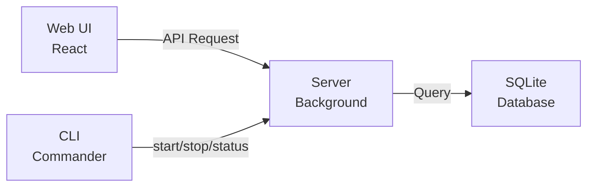
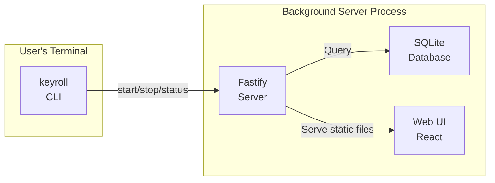

# 架构设计

## 系统概览

Keyroll 是一个 **local-first personal data storage** 系统，核心设计理念是单用户本地优先存储。

## 项目结构

```mermaid
blockDiagram
    block: src
        block: server
            note: 服务端\nFastify + better-sqlite3
        end
        block: cli
            note: 命令行工具\nCommander
        end
        block: web
            note: Web 前端\nReact + Vite
        end
        block: shared
            note: 共享类型和工具
        end
    end
    block: dist
    end
    block: docs
    end
    block: package.json
    end
```

**目录说明**:

| 目录 | 说明 |
|------|------|
| `src/server/` | 服务端（Fastify + better-sqlite3） |
| `src/cli/` | 命令行工具（Commander） |
| `src/web/` | Web 前端（React + Vite） |
| `src/shared/` | 共享类型和工具 |
| `dist/` | 构建输出 |
| `docs/` | 工程文档 |
| `package.json` | 单一包配置 |

## 系统架构



## 运行时架构



## 模块划分

| 模块 | 职责 | 技术栈 | 入口 |
|------|------|--------|------|
| Server | 核心业务逻辑、数据持久化、API 服务（后台运行） | Fastify 5.x + better-sqlite3 | `src/server/index.ts` |
| Web | 用户界面交互 | React 19 + Vite | `src/web/index.tsx` |
| CLI | 命令行操作接口、服务器生命周期管理 | Commander + chalk + ora | `src/cli/index.ts` |
| Shared | 共享类型定义和工具函数 | TypeScript | - |

## CLI 职责

CLI 是用户与 Keyroll 交互的主要接口，**仅负责服务器生命周期管理**：

| 功能 | 说明 |
|------|------|
| `setup` | 初始化系统（首次配置） |
| `start` | 启动后台 server 进程 |
| `close` | 关闭后台 server 进程 |
| 无参数 | 显示产品概要（名称、描述、版本、后台进程状态、可用命令列表） |

**设计原则**：
- CLI **不提供**任何直接读写数据的命令
- 数据访问需要通过 API 认证流程
- 数据读写由 Web UI 提供图形界面

## 技术栈

### 后端
| 技术 | 版本 | 用途 |
|------|------|------|
| Fastify | ^5.2.1 | Web 框架 |
| @fastify/cors | ^10.0.2 | CORS 插件 |
| @fastify/static | ^8.1.1 | 静态文件服务 |
| better-sqlite3 | ^11.8.1 | SQLite 数据库 |

### 前端
| 技术 | 版本 | 用途 |
|------|------|------|
| React | ^19.0.0 | UI 框架 |
| React Router | ^7.1.5 | 路由管理 |
| Ant Design | ^5.24.0 | UI 组件库 |
| Vite | ^6.1.0 | 构建工具 |
| LESS | ^4.2.2 | CSS 预处理器 |

### 开发工具
| 工具 | 版本 | 用途 |
|------|------|------|
| TypeScript | ^5.7.3 | 开发语言 |
| tsx | ^4.19.3 | TypeScript 执行环境 |
| concurrently | ^9.1.2 | 并行运行命令 |

## 数据库设计

- 使用 SQLite 单文件存储（不启用 WAL）
- 数据目录：`~/.keyroll/`
- 数据库文件：`~/.keyroll/keyroll.db`

详细数据模型参见 [数据模型文档](apispecs/model.md)。

## 设计约束

1. 主键使用 `record_key` 路径式 URN，支持前缀匹配查询
2. 时间戳使用 Unix 秒级整数
3. 使用 `deleted_at` 字段软删除
4. 域（domain）是全局元数据，不存储于本地
