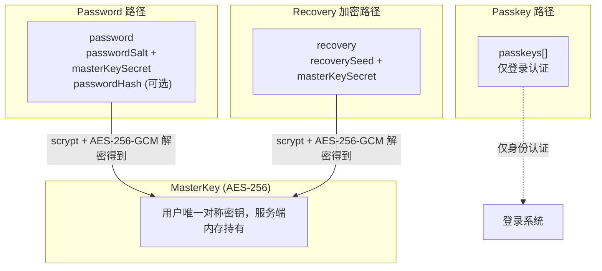

# 用户认证与安全

**状态**: 设计完成

## 概述

认证和安全是 Keyroll 的核心能力。本产品采用 local-first 设计，认证机制围绕单用户本地存储场景设计。

---

## 用户认证

### 认证模式

- 单用户认证：系统仅支持单一用户认证
- 本地认证：认证信息存储在本地 `~/.keyroll/credentials.json`
- 无多用户：不设计多用户系统

### 认证方式

| 凭证 | 用途 | 说明 |
|------|------|------|
| **Passkey** | 登录认证（优先） | 使用 WebAuthn Passkey 进行身份认证，与 MasterKey 无关 |
| **Password** | 登录认证（备用）+ MasterKey 解密 | 6 位数字密码，无 Passkey 时可用于登录，始终用于 MasterKey 解密 |
| **RecoveryCode** | 紧急恢复 | 最终恢复手段，用于重设 Password |

### 设计原则

- **Passkey 优先**：有 Passkey 时使用 Passkey 登录
- **Password 备用**：无 Passkey 时 Password 自动具备登录能力
- **多 Passkey 支持**：用户可以注册多个 Passkey
- **流程独立**：Passkey 注册/移除独立于初始化流程
- **初始化是启动自检**：服务端启动时检查 credentials.json，无需初始化 API

### Password 登录能力规则

| 状态 | passwordHash | Passkey 数量 | Password 登录能力 |
|------|-------------|-------------|-----------------|
| 无 Passkey | 存在 | 0 | ✅ 可用 |
| 有 Passkey | 存在 | 1+ | ❌ 禁用（仅用于解密） |

**规则说明**：
- Password 始终可用于 MasterKey 解密（如果有 passwordHash）
- Password 登录能力取决于是否有 Passkey
- 有 Passkey 时，Password 登录被禁用，优先使用 Passkey 登录

---

## 凭证存储

### 存储位置

`~/.keyroll/credentials.json`，独立于主数据库存储。

### 数据结构

```json
{
  "passkeys": [
    {
      "credentialId": "uuid",
      "publicKey": "<base64>",
      "counter": 0,
      "transports": ["internal", "usb"]
    }
  ],
  "recovery": {
    "recoverySeed": "<base64>",
    "masterKeySecret": "<base64>"
  },
  "password": {
    "passwordSalt": "<base64>",
    "masterKeySecret": "<base64>",
    "passwordHash": "<base64>"
  }
}
```

### passkeys 数组字段

- `credentialId`: 凭证唯一标识
- `publicKey`: Passkey 公钥 (SPKI 格式，base64)
- `counter`: 签名计数器，用于检测凭证克隆
- `transports`: 支持的传输方式，如 `internal`, `usb`, `nfc`, `ble`, `hybrid`

### recovery 对象字段

- `recoverySeed`: 用于密钥派生的种子（结合 RecoveryCode 通过 scrypt 派生加密密钥）
- `masterKeySecret`: 使用 RecoveryCode 派生的密钥加密的 MasterKey

### password 对象字段

- `passwordSalt`: 用于密钥派生的种子（随机 32 字节）
- `masterKeySecret`: 使用 Password 派生的密钥加密的 MasterKey
- `passwordHash`: Password 登录验证专用哈希（可选，存在时 Password 可登录）
  - 计算方式：`passwordHash = scrypt(password, "signin" + passwordSalt, ...)` 的哈希值
  - **用途隔离**：使用 `"signin"` 前缀拼接到 salt，与解密用的密钥派生结果独立
  - 存在 = Password 可登录
  - 不存在 = Password 仅用于 MasterKey 解密，不可登录

### RecoveryCode 说明

- 格式：4 位一组，共 5 组，大写 + 连字符（如 `A1B2-C3D4-E5F6-G7H8-I9J0`）
- 使用 Node.js 原生 `crypto.scryptSync` 从 RecoveryCode + recoverySeed 派生加密密钥
- 使用派生密钥加密 MasterKey，得到 `recovery.masterKeySecret`
- 用户需要保存两部分内容：
  - RecoveryCode（分组字符串，纸印保存）
  - credentials.json 文件备份（包含 recoverySeed + masterKeySecret）

### Password 说明

- 格式：6 位数字（如 `123456`）
- **用途隔离设计**：
  - 登录验证：`scrypt(password, "signin" + passwordSalt, ...)` 生成 `passwordHash`
  - 解密 MasterKey：`scrypt(password, "master" + passwordSalt, ...)` 生成解密密钥
- 使用 Node.js 原生 `crypto.scryptSync` 从 Password + passwordSalt 派生加密密钥
- 使用派生密钥加密 MasterKey，得到 `password.masterKeySecret`
- **用途**：
  - 始终用于 MasterKey 解密
  - 当 `passwordHash` 存在时，可用于登录认证
- 速率限制：5 次尝试/15 分钟

---

## 密钥设计

### MasterKey

- AES-256 对称加密密钥（32 字节，256 位）
- MasterKey 从不直接存储，始终保存在服务端内存中
- 通过认证方式（Password 或 RecoveryCode）派生密钥解密得到

### RecoveryCode

- 格式：4 位一组，共 5 组，大写 + 连字符（如 `A1B2-C3D4-E5F6-G7H8-I9J0`）
- 使用 Node.js 原生 `crypto.scryptSync` 从 RecoveryCode + recoverySeed 派生加密密钥
- 用户需要保存两部分内容：
  - RecoveryCode（分组字符串，纸印保存）
  - credentials.json 文件备份（包含 recoverySeed + masterKeySecret）

---

## 认证流程

### 服务端启动自检流程

**一次性操作**，在服务器启动时执行：

1. 检查 `~/.keyroll/credentials.json` 是否存在
2. 验证文件格式和必需字段
3. **如果文件不存在或无效**：
   - 进入未初始化状态
   - 等待 CLI 或 Web 配置
4. **如果文件存在且有效**：
   - 加载 MasterKey 到内存
   - 正常启动服务

### 首次配置流程

**通过 CLI 或 Web 配置向导执行**：

1. 生成 MasterKey（随机 256 位）
2. 生成 RecoveryCode（4 位一组共 5 组的大写连字符字符串）
3. 生成 recoverySeed（随机 32 字节）
4. 使用 scrypt 从 RecoveryCode + recoverySeed 派生加密密钥
5. 使用派生密钥加密 MasterKey，得到 `recovery.masterKeySecret`
6. **可选**：用户设置 6 位数字 Password
   - 生成 passwordSalt（随机 32 字节）
   - 使用 scrypt 从 Password + "master" + passwordSalt 派生密钥 K
   - 使用派生密钥 K 加密 MasterKey，得到 `password.masterKeySecret`
   - 计算 `passwordHash = scrypt(password, "signin" + passwordSalt, ...)` 用于登录验证
7. 保存 credentials.json
8. 返回 RecoveryCode 给用户保存（仅展示一次）
9. MasterKey 加载到内存
10. 正常启动服务

**注意**：
- 初始化后，如果有 passwordHash 且无 Passkey，Password 具备登录能力
- 如果未设置 Password，仅可通过 RecoveryCode 恢复

### Passkey 创建流程（独立于初始化）

用户可以在任何时候添加 Passkey：

1. 用户已登录（通过 Password 或现有 Passkey）
2. 服务端生成 WebAuthn 注册挑战
3. 客户端调用 `navigator.credentials.create()` 创建 Passkey
4. 服务端验证并存储 Passkey 公钥
5. 保存 passkeys 数据到 credentials.json

**注意**：Passkey 创建不影响 passwordHash，Password 登录能力取决于是否有 Passkey。

### Passkey 移除流程

用户可以移除已注册的 Passkey：

1. 用户已登录（通过其他 Passkey 或 Password）
2. 服务端移除指定的 Passkey
3. 更新 credentials.json

**注意**：Passkey 移除后，如果没有 Passkey 且存在 passwordHash，Password 登录能力自动恢复。

### Passkey 登录流程

1. 用户打开页面
2. 检查 `credentials.json` 中 passkeys 数组：
   - 有 Passkey → 使用 Passkey 登录
   - 无 Passkey → 使用 Password 登录
3. **Passkey 登录**：
   - 调用 WebAuthn `navigator.credentials.get()` 发起认证挑战
   - 用户完成 Passkey 验证（生物识别或设备密码）
   - 服务端验证签名，更新 counter 值
   - 认证通过，服务端颁发 AccessToken

### Password 登录流程（无 Passkey 时）

1. 用户打开页面，无可用 Passkey
2. 用户输入 6 位数字 Password
3. 服务端读取 credentials.json 中的 password 数据（passwordSalt + passwordHash）
4. 使用 scrypt 从 Password + "signin" + passwordSalt 派生密钥
5. 比对派生结果与 passwordHash：
   - 匹配 → 登录成功
   - 不匹配 → 登录失败
6. 登录成功，服务端颁发 AccessToken

### Password 解密流程（访问加密数据时）

1. 用户已登录（持有 AccessToken）
2. 用户需要访问加密数据，输入 6 位数字 Password
3. 服务端读取 credentials.json 中的 password 数据（passwordSalt + masterKeySecret）
4. 使用 scrypt 从 Password + "master" + passwordSalt 派生加密密钥
5. 使用派生密钥解密 masterKeySecret 得到 MasterKey
6. MasterKey 加载到内存
7. 服务端可以解密/加密数据

**安全提示**：Password 尝试 5 次失败后，锁定 15 分钟。

### RecoveryCode 恢复流程

1. 用户忘记 Password 或丢失所有 Passkey，使用 RecoveryCode 恢复
2. 用户输入 RecoveryCode
3. 读取 credentials.json 中的 recovery 数据（recoverySeed + masterKeySecret）
4. 使用 scrypt 从 RecoveryCode + recoverySeed 派生加密密钥
5. 使用派生密钥解密 masterKeySecret 得到 MasterKey
6. MasterKey 加载到内存
7. **清理现有 password 凭证数据**（包括 passwordHash）
8. 用户重设 Password（重建 passwordHash）
9. 可选：添加新的 Passkey

---

## 加密设计

### 加密算法

| 用途 | 算法 | 参数 |
|------|------|------|
| MasterKey 加密 | AES-256-GCM | 密钥 32 字节，IV 12 字节，authTag 16 字节 |
| 密钥派生 | scrypt | N=2^14, r=8, p=1, keyLength=32 |
| Passkey 签名 | ES256 (ECDSA P-256) | WebAuthn 标准算法 |
| Password 哈希 | scrypt | N=2^14, r=8, p=1, keyLength=32（仅哈希，不加密） |
| 数据完整性 | AES-GCM 内置 authTag | 无需额外 HMAC |

### 加密与解密流程

#### 初始化时加密流程

**Password 加密 MasterKey**

1. 生成随机 passwordSalt（32 字节）
2. 派生解密密钥 K：`scrypt(password, "master" + passwordSalt, N=2^14, r=8, p=1, keyLength=32)`
3. 生成随机 IV（12 字节）
4. 使用 AES-256-GCM 加密 MasterKey，得到 ciphertext 和 authTag
5. 存储 base64(IV || ciphertext || authTag) 到 password.masterKeySecret

**计算 Password 登录哈希**

1. 派生哈希 H：`scrypt(password, "signin" + passwordSalt, N=2^14, r=8, p=1, keyLength=32)`
2. 存储 base64(H) 到 password.passwordHash

**用途隔离说明**：passwordHash 使用 "signin" 前缀拼接到 salt，masterKeySecret 使用 "master" 前缀拼接到 salt，两者完全独立。即使 passwordHash 泄露也无法用于破解 masterKeySecret。

**RecoveryCode 加密 MasterKey**

1. 生成随机 recoverySeed（32 字节）
2. 生成 RecoveryCode（5 组 4 位大写字符）
3. 派生密钥 K：`scrypt(RecoveryCode, recoverySeed, N=2^14, r=8, p=1, keyLength=32)`
4. 生成随机 IV（12 字节）
5. 使用 AES-256-GCM 加密 MasterKey，得到 ciphertext 和 authTag
6. 存储 base64(IV || ciphertext || authTag) 到 recovery.masterKeySecret

#### 认证时解密流程

**Password 登录验证（无 Passkey 时）**

1. 用户输入 Password（6 位数字）
2. 读取 credentials.json 中的 passwordSalt 和 passwordHash
3. 计算 H = scrypt(password, "signin" + passwordSalt, ...)
4. 比对 H 与 passwordHash，匹配则登录成功

**Password 解密 MasterKey**

1. 用户输入 Password（6 位数字）
2. 读取 credentials.json 中的 passwordSalt 和 masterKeySecret（base64 编码）
3. 解析 base64 得到 IV (12 字节) || ciphertext || authTag (16 字节)
4. 计算 K = scrypt(password, "master" + passwordSalt, ...)
5. 使用 AES-256-GCM 解密得到 MasterKey，authTag 验证失败则 Password 错误

**RecoveryCode 解密 MasterKey**

1. 用户输入 RecoveryCode（5 组 4 位大写字符）
2. 读取 credentials.json 中的 recoverySeed 和 masterKeySecret（base64 编码）
3. 解析 base64 得到 IV (12 字节) || ciphertext || authTag (16 字节)
4. 计算 K = scrypt(RecoveryCode, recoverySeed, ...)
5. 使用 AES-256-GCM 解密得到 MasterKey，authTag 验证失败则 RecoveryCode 错误

### 密钥层次



### 加密字段

- `recordKey`: 不加密，需要支持前缀匹配查询
- `recordType`: 不加密，类型标识
- `recordValue`: 加密（secureLevel ≥ 1），使用 MasterKey 加密
- `contentType`: 不加密，内容类型标识
- `secureLevel`: 不加密，安全等级标识

---

## 安全等级 (secureLevel)

### 等级定义

| 等级 | 名称 | 说明 |
|------|------|------|
| `0` | 认证 | 需要认证，数据明文存储 |
| `1` | 加密 | 需要认证 + MasterKey 解密，数据加密存储 |
| `2` | 全程加密 | 需要认证 + MasterKey 解密，全程加密（含 Refer 引用的外部数据） |

### 安全策略

| 等级 | 存储 | 访问 | 传输 |
|------|------|------|------|
| `0` | 明文 | 需要认证 | 加密 |
| `1` | 加密 | 需要认证 + MasterKey 解密 | 加密 |
| `2` | 全程加密 | 需要认证 + MasterKey 解密 | 加密 |

### 使用场景

- **secureLevel 0**: 认证数据，如用户配置、公开笔记（明文存储，仅需要认证）
- **secureLevel 1**: 加密数据，如秘密信息、访问令牌（使用 MasterKey 加密存储）
- **secureLevel 2**: 全程加密数据，如敏感文件、媒体数据（使用 MasterKey 加密存储，Refer 引用的外部数据全程加密）

---

## 会话管理

### 设计原则

- 服务端启动时未认证，任何 API 请求都被拒绝（除了认证相关 API）
- Passkey 或 Password 认证成功后，服务端颁发 AccessToken（BearerToken）
- AccessToken 仅用于浏览器页面级会话，不持久化
- 页面关闭或超时后，AccessToken 失效，重新认证

### BearerToken 认证

服务端 API 使用 BearerToken 认证，通过 `Authorization` 请求头传递：

`Authorization: Bearer <access_token>`

服务端维护一个内存中的会话表（Map），记录已颁发的 AccessToken 和创建时间。
验证 Token 时检查：
1. Token 是否存在于内存会话表中
2. Token 是否超过 30 分钟未活动

无效则返回 `401 Unauthorized`。

### AccessToken 特性

- 格式：随机 UUID（v4）
- 存储：仅保存在浏览器内存中（JavaScript 变量，不写入 Storage）
- 生命周期：页面关闭后自然丢失，无需主动通知服务端
- 颁发：Passkey 或 Password 认证成功后由服务端生成并返回

### 超时登出机制

**客户端（页面）**：
1. 检测 `visibilitychange` 事件，页面隐藏时启动计时器
2. 页面不可见超过 30 分钟，本地标记会话已过期
3. 页面重新可见时，检查会话状态，已过期则跳转到登录页面

**服务端**：
1. 内存会话表记录每个 AccessToken 的最后活动时间
2. 每次 API 请求更新最后活动时间
3. Token 超过 30 分钟未活动则从内存中清理

### API 访问控制

| API | 认证要求 | 说明 |
|-----|----------|------|
| `/api/authn/passkeys/*` | 豁免 | Passkey 认证相关 |
| `/api/authn/password/*` | 豁免 | Password 认证相关 |
| `/api/authn/recovery/*` | 豁免 | RecoveryCode 恢复相关 |
| `/api/authn/sessions/*` | 需要 BearerToken | 会话管理 |
| 其他 API | 需要 BearerToken | 认证后可访问 |

**注意**：
- Passkey 和 Password 的 API 端点虽然豁免认证，但内部有独立的认证逻辑（如 challenge 验证、passwordHash 比对等）
- `/api/authn/password/create` 在系统未初始化时无需认证，系统已初始化时需要 BearerToken

---

## 访问控制

### 访问级别

- 未认证：无法访问任何数据
- 已认证（有 AccessToken）：可读取/写入 secureLevel 0 的公开数据
- 验证 + 解密（持有 MasterKey）：可读取/写入全部数据

### 权限检查流程

1. 请求到达服务端
2. 检查是否为豁免认证的 API（`/api/authn/passkeys/*`、`/api/authn/password/*`、`/api/authn/recovery/*`）
3. 检查 `Authorization: Bearer <token>` header
4. 验证 Token 是否有效（存在于内存会话中且未超时）
5. 无效则返回 `401 Unauthorized`
6. 有效则继续处理请求，根据 secureLevel 决定是否需要 MasterKey 解密

---

## 开放问题

**数据备份**：recovery 数据（recoverySeed + masterKeySecret）的云备份机制参见 [数据备份设计](data-backup.md)。

---

## 实现计划

### Phase 1 - 认证基础设施

- [x] 实现 credentials.json 数据结构（recovery 对象 + password 对象，passkeys 数组可选）
- [x] 实现系统初始化检测（已初始化/未初始化状态）
- [x] 实现 MasterKey 生成（随机 256 位）
- [x] 实现 RecoveryCode 生成（4 位一组共 5 组，大写连字符，使用 nanoid）
- [x] 实现 passwordSalt 生成（随机 32 字节）
- [x] 实现 scrypt 密钥派生
  - Password + "master" + passwordSalt → 解密密钥
  - Password + "signin" + passwordSalt → 登录哈希
  - RecoveryCode + recoverySeed → 恢复密钥
- [x] 实现 MasterKey 加密/解密（AES-256-GCM）
- [x] 实现 passwordHash 计算和验证（使用 "signin" + passwordSalt）
- [x] 实现 masterKeySecret 加密/解密流程（recovery 和 password）
- [x] 实现 UserDataDir 统一管理（~/.keyroll，server 入口统一初始化）
- [x] 实现服务端启动自检流程

### Phase 2 - Password 登录认证

- [x] 实现 Password 登录 API（验证 passwordHash，颁发 AccessToken）
- [x] 实现速率限制（5 次尝试/15 分钟）
- [x] 实现 Password 解锁 API（验证 password，解密 MasterKey）
- [x] 实现登录页面 UI（Password 输入）

### Phase 3 - RecoveryCode 恢复

- [x] 实现 RecoveryCode 验证 API（解密 masterKeySecret，恢复 MasterKey）
- [x] 实现速率限制（5 次尝试/15 分钟）
- [x] 实现 Password 重设 API（RecoveryCode 验证后重设，重建 passwordHash）
- [ ] 实现恢复流程 UI

### Phase 4 - 会话管理

- [x] 实现 BearerToken 生成（随机 UUID v4）
- [x] 实现内存会话表（Map 存储 Token 和活动时间）
- [x] 实现 BearerToken 认证中间件
- [x] 实现 API 访问控制（豁免初始化和认证相关 API）
- [ ] 实现页面 visibility 超时登出（30 分钟）
- [x] 实现登出 API

### Phase 5 - Passkey 登录（可选升级）

- [x] 实现 WebAuthn 注册（`navigator.credentials.create()`）- 前端
- [x] 实现 Passkey 添加流程（独立于初始化）
- [x] 实现多 Passkey 支持（每个 passkey 独立存储公钥）
- [x] 实现 Passkey 移除（撤销设备）
- [ ] 实现第一个 Passkey 创建后删除 passwordHash
- [ ] 实现最后一个 Passkey 移除后重建 passwordHash
- [x] 实现 WebAuthn 认证（`navigator.credentials.get()`）- 前端
- [ ] 实现 ES256 签名验证（服务端验证 Passkey 签名）
- [x] 实现 counter 更新（数据结构支持）
- [x] 实现 Passkey 登录 UI

### Phase 6 - 加密存储

- [x] 实现 secureLevel 0 存储（明文，仅认证）
- [ ] 实现 secureLevel 1 加密存储（MasterKey 加密，AES-256-GCM）
- [ ] 实现 secureLevel 2 全程加密（MasterKey 加密 + Refer 外部数据加密）
- [ ] 实现 record 级别加密/解密 API
- [x] 实现加密完整性校验（AES-GCM 内置）
