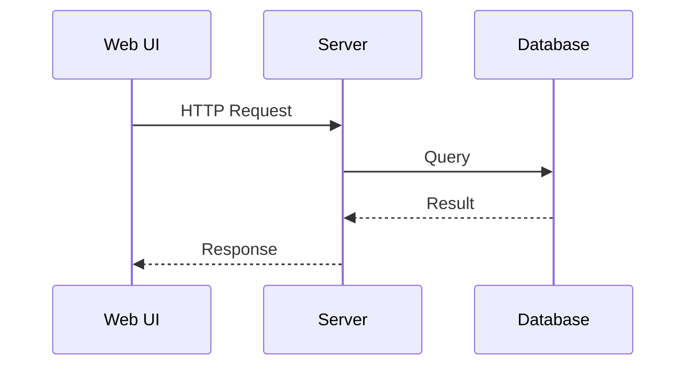
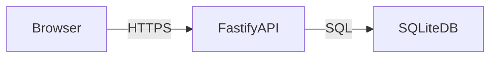

# 文档规范

## 文档结构

```
keyroll/
├── docs/
│   ├── roadmap.md          # 产品路线图和特性状态
│   ├── features/           # 功能特性设计
│   │   ├── auth-security.md  # 用户认证与安全
│   │   ├── rp-attestation.md # 本地 RP 远端认证 (付费增值)
│   │   └── data-backup.md    # 数据备份机制
│   ├── spec-api-authn.md   # 认证 API 详细规范
│   ├── spec-api.md         # API 设计规范
│   ├── spec-web.md         # Web UI 设计规范
│   ├── spec-cli.md         # CLI 设计规范
│   ├── architecture.md     # 系统架构设计
│   ├── data-model.md       # 数据模型设计
│   ├── dev-guide.md        # 开发指南
│   ├── todo-list.md        # 待办任务列表
│   └── spec-docs.md        # 本文档规范
├── AGENTS.md               # 产品概要和工作方法
└── README.md               # 项目 readme
```

## 文档职责

### AGENTS.md
- **内容**: 产品概要、工作方法
- **原则**: 保持简洁，不记录具体信息
- **更新**: 仅在工作方法变更时更新

### docs/roadmap.md
- **内容**: 产品路线图和特性实现状态
- **包含**: 各阶段特性列表、实现状态标记、开放问题

### docs/features/
- **内容**: 功能特性设计文档
- **包含**: 用户认证、安全机制、RP 远端认证等核心功能
- **命名**: `<feature-name>.md`

### docs/spec-api.md
- **内容**: API 设计规范
- **包含**: 端点定义、请求/响应格式、错误处理

### docs/spec-web.md
- **内容**: Web UI/UX 设计规范
- **包含**: 页面布局、组件设计、交互流程

### docs/spec-cli.md
- **内容**: CLI 设计规范
- **包含**: 命令列表、输出规范、使用示例

### docs/architecture.md
- **内容**: 系统架构设计
- **包含**: 技术栈、模块划分、数据流

### docs/data-model.md
- **内容**: 数据模型和类型定义
- **包含**: 核心概念、字段定义、数据库表结构、TypeScript 类型
- **用途**: `src/shared/` 目录的参考来源

### docs/dev-guide.md
- **内容**: 开发流程指南
- **包含**: 快速命令、代码规范、调试技巧

### docs/todo-list.md
- **内容**: 待办任务列表
- **包含**: 未完成的重要任务，按时间倒序排列
- **维护**: 定期清理过期任务

## 文档维护原则

1. **待办任务及时同步**: 开始新任务时更新 `todo-list.md`
2. **路线图及时同步**: 完成特性后更新 `roadmap.md` 状态
3. **数据模型与代码同步**: 类型变更时同步更新 `data-model.md` 和 `src/shared/`
4. **特性文档独立**: 每个核心功能特性在 `features/` 下独立成文
5. **规范文档分类**: API、Web、CLI 规范使用 `spec-*` 命名，架构和数据模型文档直接在 `docs/` 根目录

## 命名约定

- 待办任务：`todo-list.md`
- 规范文档：使用 `spec-*` 前缀（如 `spec-api.md`、`spec-web.md`、`spec-cli.md`）
- 设计文档：使用简短名称（如 `architecture.md`、`data-model.md`）
- 特性文档：使用短横线分隔（如 `auth-security.md`、`data-backup.md`）

## 图表绘制规范

### 禁止使用 ASCII 文本图

**文档中的代码块禁止使用 ASCII 字符绘制流程图、架构图、UI mockup 等图形**。

- 错误：使用 `─`, `│`, `┌`, `┐`, `└`, `┘`, `├`, `┤`, `┬`, `┴`, `┼`, `▶`, `◀`, `▲`, `▼` 等字符绘图
- 错误：使用 ASCII 字符绘制 UI 界面 mockup

### 例外：文件目录树

**文件目录树可以使用 TUI 风格的目录树表达方式**：

```
keyroll/
├── src/
│   ├── server/
│   ├── cli/
│   ├── web/
│   └── shared/
├── docs/
└── package.json
```

### 使用 Mermaid 绘制图表

如需绘制流程图、序列图、架构图、组件图等，使用 Mermaid 语法。

**序列图示例**:


**组件图示例**:
```mermaid
blockDiagram
    block: Web UI
        block: React App
    end
    block: Server
        block: Fastify API
        block: SQLite
    end
    React App --> Fastify API: HTTP
    Fastify API --> SQLite: Query
```

**流程图示例**:

